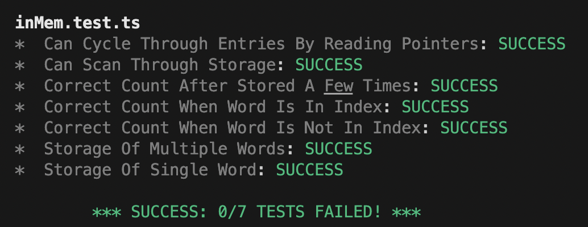
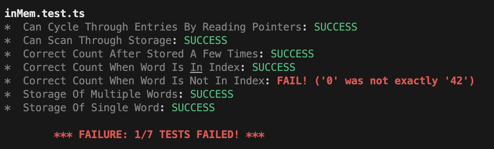

# Random Design Data Intensive Applications inspired stuff

Contains a few different random bits and bobs that I wanted to try out whilst reading DDIA (still currently reading).

## HashStore

A data store based on a simple single threaded append only log paired with an in-memory index.
There are currently two implementations:

- `npm run hash:mem`: An in memory version which just uses a simple string to store the log
- `npm run hash:file`: A file based version that writes to the file systems in a series of size bounded segment files

The file based version is a bit of a work in progress as I still want to add log compaction to it and rebuilding the index.

## Trie

I can't quite remember why now but I wrote something that allowed streaming a load of words into a trie data store:

`cat src/trie/sampleWords.txt | ts-node --esm src/trie/trie.ts`

It also prints it out in a [Radix Tree](https://en.wikipedia.org/wiki/Radix_tree) format

## Test

Bit of yak shaving when working on the in memory store but wrote a very simple test framework to support it.

`ts-node --esm src/test/runner.ts`

Tests are modules that end with `.test.ts`:

```ts
let store: Store;

// Optional function run before each test
export function beforeEach() {
  store = new Store();
}

// Exported function start with the word test
export function testCorrectCountWhenWordIsNotInIndex() {
  const word = "aaaa";
  checkExactEquals(store.getCount(word), 0);
}
```

There is a module containing some simple assertions though any error thrown by a test should be caught and reported correctly.

Successful results looks like:



Unsuccessful results look like:



Failed tests will set the unix return code correctly, but this can be disabled by setting an env var: `REPORT_ERROR_STATUS=false`.

Tests will print out some colour output, to disable set the env var: `DISABLE_ANSI_COLOURS=true`

To watch tests:

   `REPORT_ERROR_STATUS=false nodemon --watch src -e ts,js --exec 'ts-node --esm src/test/runner.ts'`
